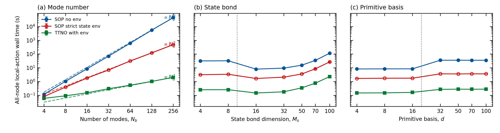
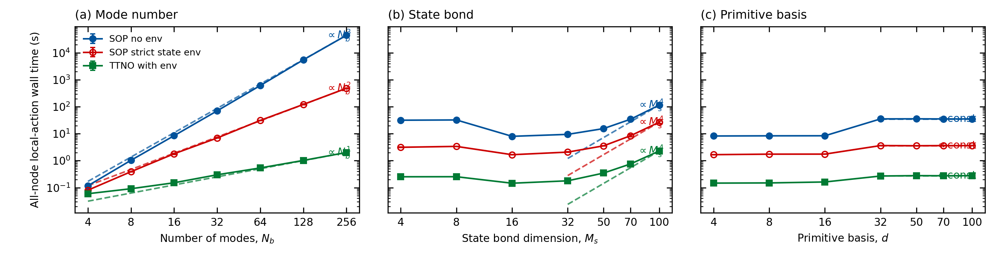
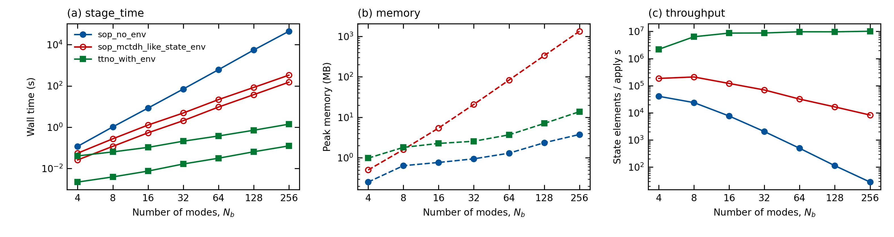
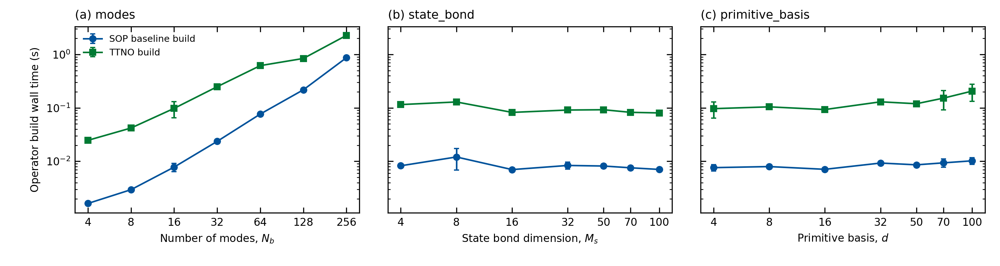

# 补充实验报告：TTNO 局部作用步骤的优化证据

> 生成日期：2026-08-07
> 数据来源：`benchmarks/results/operator_env_scaling/`（Slurm 原子快照）
> 图件目录：`benchmarks/results/operator_env_scaling/figures/`

## 0. 总前提与口径

所有实验回答同一个问题：**在波函数 ansatz、tree 拓扑、symbolic Hamiltonian
完全相同的条件下，TTNO 的局部作用步骤（local effective action）为什么快、
快在哪个阶段、是否只是实现假象。**

- 测量对象：`local_effective_1site_apply_all_nodes`，即全树 one-site local
  effective Hamiltonian action 的 wall time（含 environment 构建与应用）。
- 三条路径：`sop_no_env`（flat SOP，无 environment）、
  `sop_mctdh_like_state_env`（strict per-term state environment）、
  `ttno_with_env`（TTNO + contraction environment）。
- 数值一致性：所有路径与 TTNO 参考的相对误差 ~1e-15，说明比的是同一计算对象。
- 刻意边界：不测完整 TDVP/传播步；不与 Heidelberg MCTDH 生产代码做
  head-to-head；构造成本在正式 action 图中不计时，单独用补充实验测量。
- 正式数据：Li.W.2024 spin-boson 189/189 snapshots；construction 补充
  63/63 snapshots；Hubbard balanced 补充实验进行中。

## 1. 主文图：modes 标度（spin-boson，SI 用全指数版）



**前提**：固定 M_s=20、d=10（paired leaf），只增大声子 mode 数
N_b=4…256。N_b 是唯一“物理系统大小”方向：term 数（1+3N_b）、树节点数
都随 N_b 增长，因此这是算法随系统变大的主 scaling 面板。

**结果**（largest-four log-log 拟合）：

| 方法 | α（vs N_b） | r² |
| --- | ---: | ---: |
| `sop_no_env` | 3.109 | 0.9999 |
| `sop_mctdh_like_state_env` | 2.035 | 0.9995 |
| `ttno_with_env` | 0.916 | 0.9989 |

**启示**：no-env 每次在“每个 term × 每个 active node”上重算整棵子树，出现
N_b³；只复用 per-term state environment 后降到 N_b²；TTNO 再通过 operator
bond 共享结构，降到近线性 N_b。效率差异可以定量拆成“state reuse”和
“operator-structure reuse”两层，这正是本工作要证明的核心。

## 2. SI 全指数图：M_s 与 d 面板



**前提**：M_s 与 d 是精度/局域基参数，不是系统大小；正文不报它们的指数。
SI 保留 largest-four fits 与幂次参考线，供审稿人复核。

**结果**：

| panel | `sop_no_env` | strict state env | `ttno_with_env` |
| --- | ---: | ---: | ---: |
| `M_s` | 2.180 | 2.243 | 2.223 |
| large `d` | −0.004 | 0.002 | 0.024 |

**启示**：
- M_s panel 三条方法指数几乎相同（约 2.2），说明 M_s 方向的相对排名由
  通用收缩成本决定，不是 TTNO 特有问题；这是“有效 wall-time 指数”，
  isolated full-rank internal contraction 的 FLOP 仍是精确 M_s⁴。
- 大 d 近常数发生在 d > M_s 的 contracted layout 下（leaf 从 d⁴ 降为 d²，
  但 active node 数翻倍，跳变来自拓扑切换），不是 leaf 计算 O(1)。
- 两种布局的机制详见
  `llmdoc/architecture/paired-vs-contracted-leaves.md`。

## 3. SI 阶段分解：时间、内存与吞吐



**前提**：N_b 总指数可能是单一阶段主导的假象，因此把 total 拆成
`env build` 与 `apply`，并报告峰值内存和“每秒处理的 state 元素数”
（elements/s，明确不是 FLOPs）。

**结果**（largest-four α vs N_b，来自 189 个正式 snapshots）：

| 方法 | env α | apply α | memory α | elements/s α |
| --- | ---: | ---: | ---: | ---: |
| `sop_no_env` | — | 3.109 | 0.685 | −2.067 |
| `sop_mctdh_like_state_env` | 2.024 | 2.058 | 2.000 | −1.016 |
| `ttno_with_env` | 0.915 | 0.978 | 0.822 | 0.063 |

**启示**：
- no-env 的 N³ 完全来自 apply 阶段（它本来就没有 env）；
- strict SOP 的 N² 由 env 与 apply 共同贡献，内存也按 N² 涨；
- TTNO 的 env 与 apply 都接近线性，内存亚线性，elements/s 基本恒定
  （约 10⁷/s），说明它的线性不是“省了某一段、另一段爆炸”造成的；
- 因此 N_b³/N_b²/N_b 是 reuse 结构的系统性结果，不是计时对象选择或
  单阶段假象。

## 4. SI 构造成本：SOP vs TTNO 的一次性开销



**前提**：正式 action 图不含算符构造；构造是一次性成本，可在整条 dynamics
中摊销。本实验单独计时 `SOPBaselineOperator.from_symbolic_terms` 与
`TTNO(tree, terms)`，63/63 snapshots。

**结果**（largest-four α）：

| panel | SOP build α | TTNO build α |
| --- | ---: | ---: |
| `N_b`（modes） | 1.710 | 1.001 |
| `M_s` | −0.155 | −0.126 |
| large `d`（contracted） | 0.092 | 0.416 |

**启示**：
- modes 方向 TTNO 构造接近线性、SOP 基线约 N^1.7（symbolic 拆项开销），
  即使把构造算进去也不会逆转“action 阶段 TTNO 更优”的结论；
- 构造对 state bond M_s 基本不敏感（指数≈0，轻微负值来自噪声）；
- 大 d 方向 TTNO 构造的 0.42 是 contracted layout 下的有限窗口有效指数，
  operator storage 本身仍按 d² 增长（见 contraction diagnostics）；
  paired layout 的 d⁴ 已在诊断中单独确认。

## 5. Hubbard junction balanced 补充实验（进行中）

**前提**：spin-boson 的 N_b³/N_b²/N_b 需要第二个物理模型佐证，避免被解读为
模型特例。使用本论文的 Hubbard junction 分子结模型：

- lead 与 phonon 成比例增长：(n_lead, n_phonon) =
  (4,1), (8,2), (16,4), (32,8), (64,16)；
- `N_total = 4·n_lead + 2 + n_phonon`，term 数约 `12·n_lead + 4·n_phonon`
  （小尺寸下 symbolic 合并后以实际 `n_sop_terms` 为准）；
- 固定 M_s=20、d=10、paired leaf，3 方法 × 3 repeats = 45 个 array tasks。

**状态**：截至本报告生成，已完成 33/45（小尺寸点全部 ok，相对误差 ~1e-15）；
finalize 作业在 array 结束后自动运行。

**预期启示**：
- 若重现 N³/N²/N，说明 reuse 结构差异是表示层的普适性质；
- 若指数偏离（例如 fermionic Jordan-Wigner 串使 strict SOP 更贵），则
  说明 term 结构会改变 reuse 收益，这本身是论文值得讨论的边界。

## 6. 总体启示与边界

1. TTNO 的优势不是单一阶段或实现假象：apply 与 env 都近线性，内存亚线性，
   吞吐恒定，构造一次性成本可控。
2. strict MCTDH-like SOP 在只复用 state environment 时是 N²；多出来的
   “N² → N” 来自 operator-structure sharing，这是 TTNO 表示层的真正贡献。
3. 所有结论限定于 local action kernel 与文中两个模型；不构成完整传播步
   计时，也不与 Heidelberg MCTDH 做对抗式对比。

## 附：结果文件组织

图件（语义化命名，PDF+PNG 成对）统一在：

```text
benchmarks/results/operator_env_scaling/figures/
  li2024_modes_main_scaling.{pdf,png}        # 正文主图
  li2024_si_scaling.{pdf,png}                # SI 全指数图
  li2024_si_stage_breakdown.{pdf,png}        # SI 阶段分解
  li2024_si_construction_scaling.{pdf,png}   # SI 构造成本
  hubbard_balanced_scaling.{pdf,png}         # Hubbard balanced（待 finalize）
```

summary/fits CSV 保留在
`benchmarks/results/operator_env_scaling/final/li2024_spin_boson_20260713_*`
与 `…/hubbard_balanced/`，由 Slurm finalizer 再生成，不入 git。
