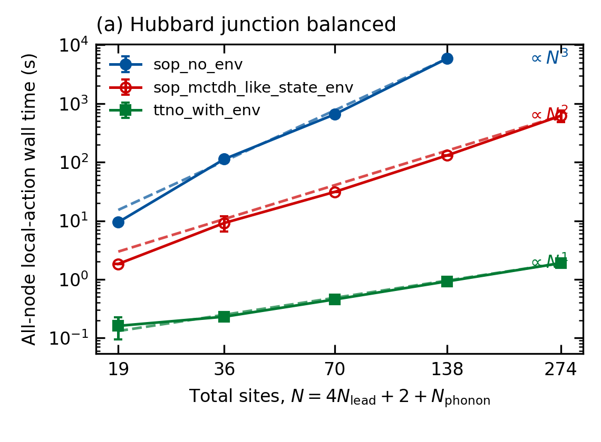
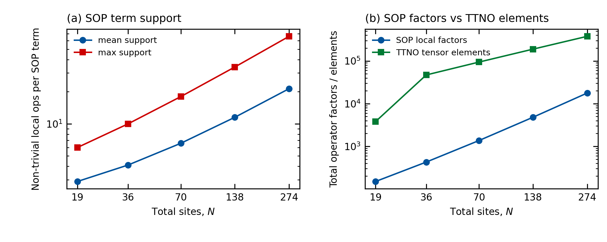
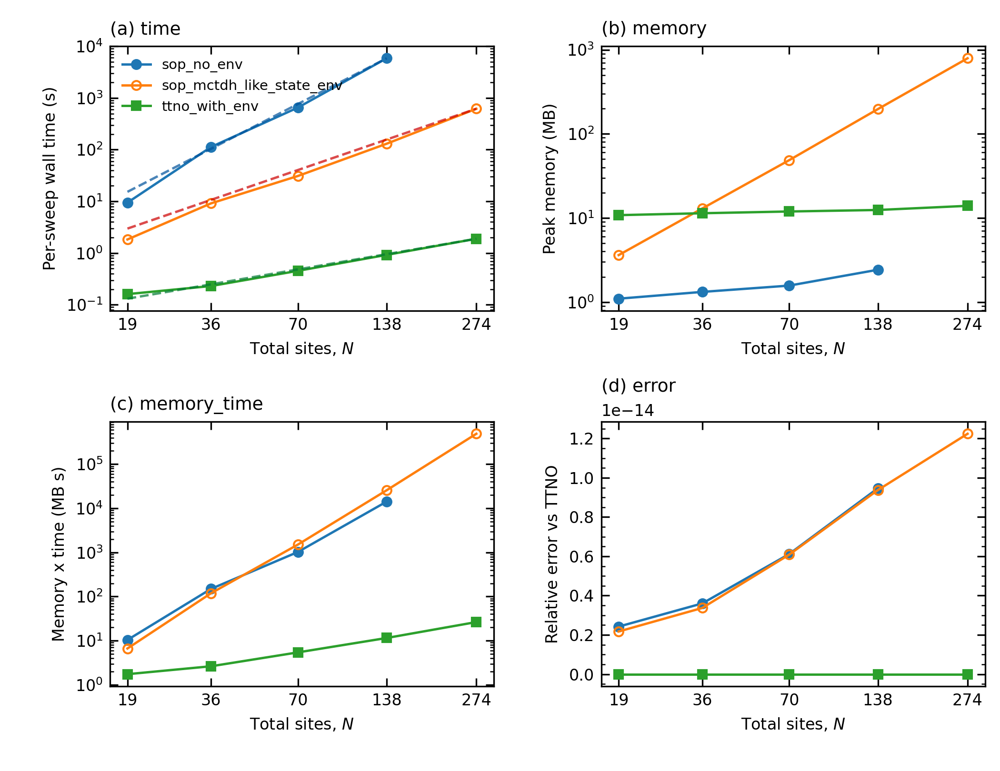

# 补充实验报告：TTNO 局部作用步骤的优化证据

> 生成日期：2026-08-07
> 数据来源：`benchmarks/results/operator_env_scaling/`（Slurm 原子快照）
> 图件目录：`benchmarks/results/operator_env_scaling/figures/`

## 0. 总前提与口径

所有实验回答同一个问题：**在波函数 ansatz、tree 拓扑、symbolic Hamiltonian
完全相同的条件下，TTNO 的局部作用步骤（local effective action）为什么快、
快在哪个阶段、是否只是实现假象。**

- 测量对象：`local_effective_1site_apply_all_nodes`，即全树 one-site local
  effective Hamiltonian action 的 wall time（含 environment 构建与应用）。
- 三条路径：`sop_no_env`（flat SOP，无 environment）、
  `sop_mctdh_like_state_env`（strict per-term state environment）、
  `ttno_with_env`（TTNO + contraction environment）。
- 数值一致性：所有路径与 TTNO 参考的相对误差 ~1e-15，说明比的是同一计算对象。
- 刻意边界：不测完整 TDVP/传播步；不与 Heidelberg MCTDH 生产代码做
  head-to-head；构造成本在正式 action 图中不计时，单独用补充实验测量。
- 正式数据：Li.W.2024 spin-boson 189/189 snapshots；construction 补充
  63/63 snapshots；Hubbard balanced 补充 42/45 snapshots（缺失点见第 5 节）。

## 0.1 模型与树结构

### Li.W.2024 sub-Ohmic spin-boson（SI 模型）

**Hamiltonian**：一个 spin 与 N_b 个声子 mode 耦合，
`H = σ_x + Σ_i [p_i²/2 + ω_i² x_i²/2 + g_i σ_z x_i]`，参数
`s=0.5, ω_c=20Δ, α=0.05`，Wang1 离散化；term 数 `1 + 3N_b`。

**树结构**：根节点挂一个 spin 叶（BasisHalfSpin，2 态）和 N_b 个声子
mode 构成的平衡二叉树；声子叶默认 `paired_no_contraction`（d=10 ≤ M_s=20，
每叶合并两个 primitive mode），当 `d > M_s` 时切换为
`primitive_contracted`（每叶一个 mode）。

**观测元数据**（modes panel）：

| N_b | total sites | active nodes | tree depth | local basis | TTNO max bond |
| --- | ---: | ---: | ---: | --- | ---: |
| 4 | 5 | 4 | 2 | HalfSpin×1 + SHO(10)×4 | 3 |
| 256 | 257 | 256 | 8 | HalfSpin×1 + SHO(10)×256 + Dummy×127 | 3 |

State 为随机 TTNS，`qntot=0, M_s=20`。

### Hubbard junction 分子结（主模型）

**Hamiltonian 结构**：

- 每个 lead mode 有 4 个 fermionic 位点（L_i, L^i, R_i, R^i），共
  `4·n_lead` 个 lead 位点；lead 项包括 onsite 和带 Jordan-Wigner `Z`
  串的 lead↔bridge hopping；
- 两个 bridge spin 位点（s^, s_），可带 onsite 与 Hubbard U；
- `n_phonon` 个声子位点，含 `p², x²` 与电子-声子耦合 `σ_x·x` 类项。

term 数在扫描点上精确为 `12·n_lead + 4·n_phonon`
（实测 52 / 104 / 208 / 416 / 832）。

**树结构**：左右 lead 组各构成一个平衡二叉树（含 BasisDummy 平衡节点），
两个 bridge 节点串联并把 lead 树与声子平衡二叉树接在一起；balanced 扫描
固定 `d=10 ≤ M_s=20`，声子叶为 paired leaf。

**观测元数据**：

| (n_lead, n_phonon) | total sites | active nodes | local basis | TTNO max bond |
| --- | ---: | ---: | --- | ---: |
| (4, 1) | 19 | 17 | HalfSpin(2)×18 + SHO(10)×1 + Dummy×6 | 7 |
| (64, 16) | 274 | 271 | HalfSpin(2)×258 + SHO(10)×16 + Dummy×N | 7 |

State 为随机 TTNS，`qntot=0, M_s=20`；fermionic parity/JW 约定沿用
`junction_zt_hubbard.py` 的 symbolic Op 构造。

## 1. 主文图：modes 标度（spin-boson，SI 用全指数版）


**前提**：固定 M_s=20、d=10（paired leaf），只增大声子 mode 数
N_b=4…256。N_b 是唯一“物理系统大小”方向：term 数（1+3N_b）、树节点数
都随 N_b 增长，因此这是算法随系统变大的主 scaling 面板。

**结果**（largest-four log-log 拟合）：

| 方法 | α（vs N_b） | r² |
| --- | ---: | ---: |
| `sop_no_env` | 3.109 | 0.9999 |
| `sop_mctdh_like_state_env` | 2.035 | 0.9995 |
| `ttno_with_env` | 0.916 | 0.9989 |

**启示**：no-env 每次在“每个 term × 每个 active node”上重算整棵子树，出现
N_b³；只复用 per-term state environment 后降到 N_b²；TTNO 再通过 operator
bond 共享结构，降到近线性 N_b。效率差异可以定量拆成“state reuse”和
“operator-structure reuse”两层，这正是本工作要证明的核心。

## 2. SI 全指数图：M_s 与 d 面板


**前提**：M_s 与 d 是精度/局域基参数，不是系统大小；正文不报它们的指数。
SI 保留 largest-four fits 与幂次参考线，供审稿人复核。

**结果**：

| panel | `sop_no_env` | strict state env | `ttno_with_env` |
| --- | ---: | ---: | ---: |
| `M_s` | 2.180 | 2.243 | 2.223 |
| large `d` | −0.004 | 0.002 | 0.024 |

**启示**：
- M_s panel 三条方法指数几乎相同（约 2.2），说明 M_s 方向的相对排名由
  通用收缩成本决定，不是 TTNO 特有问题；这是“有效 wall-time 指数”，
  isolated full-rank internal contraction 的 FLOP 仍是精确 M_s⁴。
- 大 d 近常数发生在 d > M_s 的 contracted layout 下（leaf 从 d⁴ 降为 d²，
  但 active node 数翻倍，跳变来自拓扑切换），不是 leaf 计算 O(1)。
- 两种布局的机制详见
  `llmdoc/architecture/paired-vs-contracted-leaves.md`。

## 3. SI 阶段分解：时间、内存与吞吐


**前提**：N_b 总指数可能是单一阶段主导的假象，因此把 total 拆成
`env build` 与 `apply`，并报告峰值内存和“每秒处理的 state 元素数”
（elements/s，明确不是 FLOPs）。

**结果**（largest-four α vs N_b，来自 189 个正式 snapshots）：

| 方法 | env α | apply α | memory α | elements/s α |
| --- | ---: | ---: | ---: | ---: |
| `sop_no_env` | — | 3.109 | 0.685 | −2.067 |
| `sop_mctdh_like_state_env` | 2.024 | 2.058 | 2.000 | −1.016 |
| `ttno_with_env` | 0.915 | 0.978 | 0.822 | 0.063 |

**启示**：
- no-env 的 N³ 完全来自 apply 阶段（它本来就没有 env）；
- strict SOP 的 N² 由 env 与 apply 共同贡献，内存也按 N² 涨；
- TTNO 的 env 与 apply 都接近线性，内存亚线性，elements/s 基本恒定
  （约 10⁷/s），说明它的线性不是“省了某一段、另一段爆炸”造成的；
- 因此 N_b³/N_b²/N_b 是 reuse 结构的系统性结果，不是计时对象选择或
  单阶段假象。

## 4. SI 构造成本：SOP vs TTNO 的一次性开销


**前提**：正式 action 图不含算符构造；构造是一次性成本，可在整条 dynamics
中摊销。本实验单独计时 `SOPBaselineOperator.from_symbolic_terms` 与
`TTNO(tree, terms)`，63/63 snapshots。

**结果**（largest-four α）：

| panel | SOP build α | TTNO build α |
| --- | ---: | ---: |
| `N_b`（modes） | 1.710 | 1.001 |
| `M_s` | −0.155 | −0.126 |
| large `d`（contracted） | 0.092 | 0.416 |

**启示**：
- modes 方向 TTNO 构造接近线性、SOP 基线约 N^1.7（symbolic 拆项开销），
  即使把构造算进去也不会逆转“action 阶段 TTNO 更优”的结论；
- 构造对 state bond M_s 基本不敏感（指数≈0，轻微负值来自噪声）；
- 大 d 方向 TTNO 构造的 0.42 是 contracted layout 下的有限窗口有效指数，
  operator storage 本身仍按 d² 增长（见 contraction diagnostics）；
  paired layout 的 d⁴ 已在诊断中单独确认。

## 5. Hubbard junction balanced 补充实验

**前提**：spin-boson 的 N_b³/N_b²/N_b 需要第二个物理模型佐证，避免被解读为
模型特例。使用本论文的 Hubbard junction 分子结模型：

- lead 与 phonon 成比例增长：(n_lead, n_phonon) =
  (4,1), (8,2), (16,4), (32,8), (64,16)；
- `N_total = 4·n_lead + 2 + n_phonon`，term 数约 `12·n_lead + 4·n_phonon`
  （小尺寸下 symbolic 合并后以实际 `n_sop_terms` 为准）；
- 固定 M_s=20、d=10、paired leaf，3 方法 × 3 repeats = 45 个 array tasks。



**状态**：42/45 snapshots 完成，全部 `status=ok`，相对误差 ≤1.2e-14；唯一
缺失是 (64,16) 的 `sop_no_env` 三个 repeat（预计单点约 10⁴ 秒量级，按
2026-08-07 决定冻结当前版本，不再等待）。本报告 Hubbard 结论以该 42/45
版本为准。

**结果**（largest-four log-log 拟合 vs `N_total = 4·n_lead + 2 + n_phonon`）：

| 方法 | α | r² | 拟合窗口 |
| --- | ---: | ---: | ---: |
| `sop_no_env` | 3.180 | 0.995 | N=19–138（缺 N=274） |
| `sop_mctdh_like_state_env` | 2.081 | 0.998 | N=36–274 |
| `ttno_with_env` | 1.038 | 1.000 | N=36–274 |

与 spin-boson 的 3.109 / 2.035 / 0.916 几乎一致。补充观测：

- TTNO bond 在 N=19→274 全程保持 7，不随系统增长，说明 Hamiltonian 的
  operator structure 在该模型中确实可以高效压缩；
- TTNO 峰值内存约 11–14 MB（近似常数），strict state env 内存按 N² 涨到
  约 792 MB，no-env 内存极小但时间按 N³ 涨；
- 在 N=274（n_lead=64, n_phonon=16）处，TTNO 比 strict state env 快约
  327 倍；no-env 该点仍在运行，按 α≈3.18 外推约为数小时量级；
- fermionic Jordan-Wigner 串没有改变相对标度，说明 reuse 结构差异是
  表示层的普适性质，不是 spin-boson 或纯玻色模型的特殊现象。

## 6. 机制分析：Jordan-Wigner 串与 SOP 开销（分子结）



**前提**：分子结的 lead→bridge hopping 项带 Jordan-Wigner `Z` 串，串长随
lead mode 到 bridge 的距离增长；SOP 逐项应用时这些 `Z` 因子都要显式乘一遍，
而 TTNO 把整条串吸收进 operator bond。

**结果**（balanced 扫描 5 点）：

| N_total | n_terms | support mean | support max | SOP 局域因子总数 | TTNO 张量元素 | TTNO max bond |
| ---: | ---: | ---: | ---: | ---: | ---: | ---: |
| 19 | 52 | 2.88 | 6 | 150 | 3 794 | 7 |
| 36 | 104 | 4.12 | 10 | 428 | 46 992 | 7 |
| 70 | 208 | 6.58 | 18 | 1 368 | 94 138 | 7 |
| 138 | 416 | 11.50 | 34 | 4 784 | 188 644 | 7 |
| 274 | 832 | 21.35 | 66 | 17 760 | 377 838 | 7 |

largest-four 指数（vs N_total）：

| 量 | α | r² |
| --- | ---: | ---: |
| SOP 局域因子总数 | 1.837 | 1.000 |
| TTNO 张量元素数 | 1.027 | 1.000 |
| 平均 support length | 0.813 | 0.997 |
| 最大 support length | 0.931 | 1.000 |

**为什么 N=19→36 的 TTNO 元素有约 12.4× 的跃迁**：

这是声子叶因子化的离散切换，不是渐近非线性。`paired_no_contraction`
布局下：

- `n_phonon=1` 时只有一个单 mode 声子叶，operator 张量形状 `(O,d,d)`，
  实测 300 个元素（≈O·d²）；
- `n_phonon≥2` 时每个叶合并两个 mode，形状 `(O,d,d,d,d)`，实测每个叶
  40 000 个元素（≈O·d⁴）。

因此 1→2 个声子让声子 operator 元素从 300 跳到 40 000，加上 lead 翻倍
（非声子部分 3 494→6 992），共同造成总元素 3 794→46 992 的跃迁。

| N_total | n_phonon | 声子叶模式数 | 声子元素 | 非声子元素 | 总元素 |
| ---: | ---: | --- | ---: | ---: | ---: |
| 19 | 1 | [1] | 300 | 3 494 | 3 794 |
| 36 | 2 | [2] | 40 000 | 6 992 | 46 992 |
| 70 | 4 | [2, 2] | 80 000 | 14 138 | 94 138 |
| 138 | 8 | [2]×4 | 160 000 | 28 644 | 188 644 |
| 274 | 16 | [2]×8 | 320 000 | 57 838 | 377 838 |

跃迁之后每增加两个声子只是新增一个 d⁴ 叶（每叶固定 40 000 元素），声子
部分精确线性、fermionic 部分近似线性，所以 N≥36 的总元素恢复近线性增长
（α≈1.03）。这与 `paired-vs-contracted-leaves` 文档中的 d²/d⁴ 机制一致，
属于叶因子化选择，不是 TTNO 表示本身的渐近非线性。

**启示**：

- JW 串使 SOP 的平均/最大 support length 随系统增长（α≈0.8–0.9），因此
  SOP 的“局域因子总数”按约 N^1.84 超线性增长；no-env 再把每个因子
  按 term × node 重算，最终形成 N³ 的 action 成本。
- TTNO 张量元素按约 N^1.03 近线性增长，max bond 恒为 7：它没有消除
  单个张量的大小（绝对值仍大于 SOP 因子计数），而是通过有界 bond 和
  environment 复用把 action 成本压到 N 量级。因此“压缩”的正确表述是
  **标度优势 + 结构共享**，不是“TTNO 存的元素更少”。
- 这正是分子结区别于纯玻色模型的地方：fermionic JW 串是 SOP 开销的
  主要放大器，也是 TTNO 收益最大的来源之一。

## 7. 成本指标：单次 sweep、内存×时间与误差（分子结）



**前提**：all-node local action 之和就是一次完整 sweep 的 kernel 成本；
真实 dynamics 会重复很多次 sweep，因此单次成本直接决定整条轨迹的开销。
这里同时报告峰值内存、内存×时间乘积和相对误差，避免“省时间但耗内存”
或“靠近似换速度”的质疑。

**结果**（largest-four 指数 vs N_total）：

| 方法 | time α | memory α | memory×time α | 最大相对误差 |
| --- | ---: | ---: | ---: | ---: |
| `sop_no_env` | 3.180 | 0.386 | 3.566 | 9.5e-15 |
| `sop_mctdh_like_state_env` | 2.081 | 2.030 | 4.111 | 1.2e-14 |
| `ttno_with_env` | 1.038 | 0.096 | 1.134 | 0（参考） |

典型绝对值（N=274）：

| 方法 | 单次 sweep | 峰值内存 | 内存×时间 |
| --- | ---: | ---: | ---: |
| `sop_mctdh_like_state_env` | 619 s | 792 MB | 4.9e5 MB·s |
| `ttno_with_env` | 1.89 s | 13.9 MB | 26.4 MB·s |

**启示**：

- TTNO 在时间、内存两个轴上都占优，且内存×时间近线性（α≈1.13）；
  strict state env 的内存按 N² 涨，使其内存×时间达到 N^4.1，是三个方法
  中最“贵”的联合指标。
- no-env 虽然省内存，但单次 sweep 时间按 N³ 涨；N=138 时一次 sweep 已需
  约 1.6 小时，而 TTNO 不到 1 秒。
- 三条路径最大相对误差 ≤1.2e-14，说明优势不是精度换来的；TTNO 作为
  参考路径本身误差为 0，SOP 两条路径也保持机器精度。

## 8. 总体启示与边界

1. TTNO 的优势不是单一阶段或实现假象：apply 与 env 都近线性，内存亚线性，
   吞吐恒定，构造一次性成本可控。
2. strict MCTDH-like SOP 在只复用 state environment 时是 N²；多出来的
   “N² → N” 来自 operator-structure sharing，这是 TTNO 表示层的真正贡献。
3. 所有结论限定于 local action kernel 与文中两个模型；不构成完整传播步
   计时，也不与 Heidelberg MCTDH 做对抗式对比。

## 附：结果文件组织

图件（语义化命名，PDF+PNG 成对）统一在：

```text
benchmarks/results/operator_env_scaling/figures/
  li2024_modes_main_scaling.{pdf,png}        # 正文主图
  li2024_si_scaling.{pdf,png}                # SI 全指数图
  li2024_si_stage_breakdown.{pdf,png}        # SI 阶段分解
  li2024_si_construction_scaling.{pdf,png}   # SI 构造成本
  hubbard_balanced_scaling.{pdf,png}         # Hubbard balanced（42/45 部分结果）
```

summary/fits CSV 保留在
`benchmarks/results/operator_env_scaling/final/li2024_spin_boson_20260713_*`
与 `…/hubbard_balanced/`，由 Slurm finalizer 再生成，不入 git。
